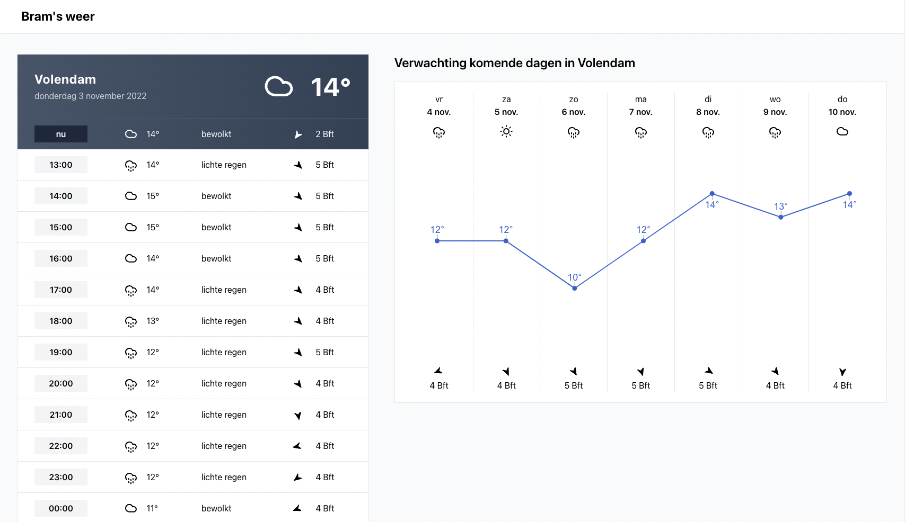

I've created this simple weather app to learn React.

### Sandbox

The sandbox will be launched when using `npm run install && npm run start`. The data which is used is from the JSON
file `src/mock_data.json`.

### Production

If you'd like to launch the application in production mode, follow these steps:

1. Get a LocationIQ API key (https://locationiq.com/)
2. Get a OpenWeather API key (https://openweathermap.org/api)
3. Copy the .env.example file and paste it in .env
4. Fill in REACT_APP_LOCATION_IQ_KEY and REACT_APP_OPENWEATHERMAP_KEY
5. Run `npm run production`
6. Run `serve -s build`. No serve installed? Run `npm install -g serve` first.

